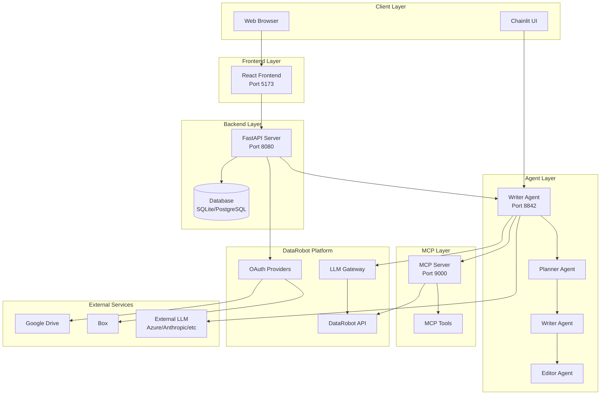
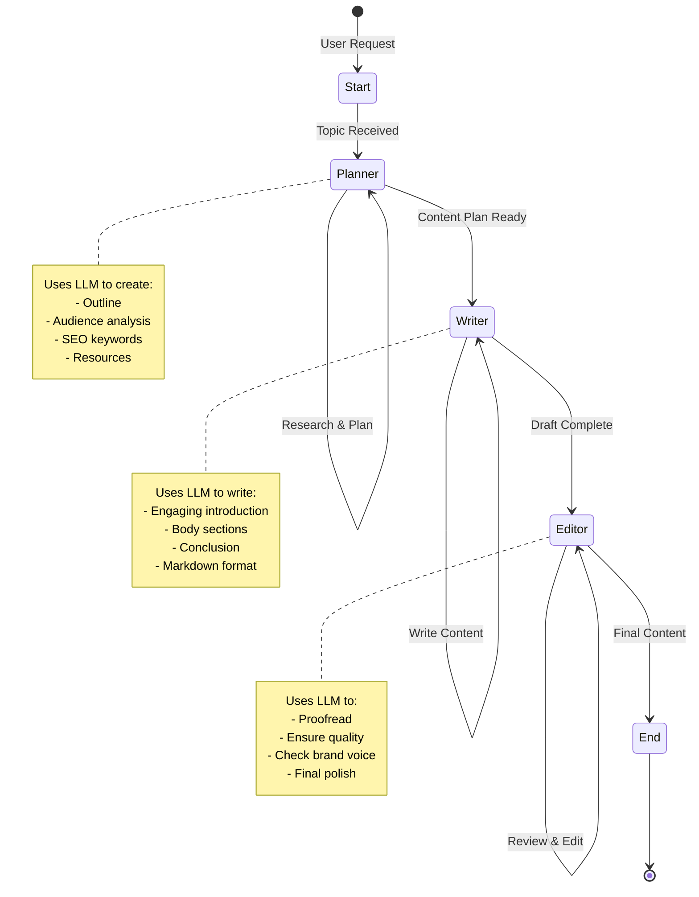
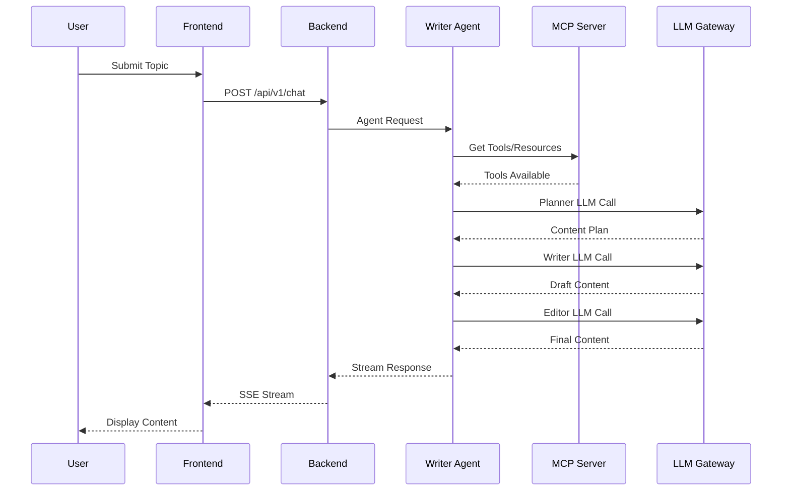
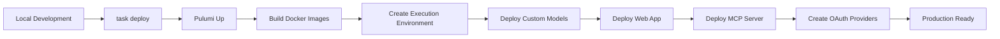

<p align="center">
  <a href="https://github.com/datarobot-community/datarobot-agent-application">
    
  </a>
</p>
<p align="center">
    <span style="font-size: 1.5em; font-weight: bold; display: block;">DataRobot Agentic Workflow Application Template</span>
</p>

<p align="center">
  <a href="https://datarobot.com">Homepage</a>
  ·
  <a href="https://docs.datarobot.com/en/docs/agentic-ai/agentic-develop/index.html">Documentation</a>
  ·
  <a href="https://docs.datarobot.com/en/docs/get-started/troubleshooting/general-help.html">Support</a>
</p>

<p align="center">
  <a href="https://github.com/datarobot-community/datarobot-agent-application/tags">
    
  </a>
  <a href="/LICENSE.txt">
    
  </a>
</p>

---

# 📖 Overview

This repository provides a **production-ready application template** for building and deploying **agentic workflows** with multi-agent frameworks, a FastAPI backend server, a React frontend, and an MCP (Model Context Protocol) server. The template streamlines the process of setting up new AI agent workflows with minimal configuration requirements, supporting both local development and one-command deployments to production environments within DataRobot.

The application demonstrates a **multi-agent content creation system** where specialized agents (planner, writer, and editor) collaborate to produce high-quality blog content. It integrates seamlessly with DataRobot's LLM Gateway, supports external LLM providers, and provides a complete web interface for interacting with agents.

**Key Highlights:**
- 🚀 **Full-stack application** with React frontend, FastAPI backend, and agent services
- 🤖 **Multi-agent architecture** using LangGraph for orchestration
- 🔌 **MCP Server integration** for tool and resource management
- ☁️ **DataRobot deployment** with Infrastructure as Code (Pulumi)
- 🔐 **OAuth support** for Google Drive and Box integration
- 📊 **OpenTelemetry tracing** for observability
- 🧪 **Comprehensive testing** with pytest and vitest

```diff
-IMPORTANT: This repository updates frequently. Make sure to update your
-local branch regularly to obtain the latest changes.
```

---

# ✨ Features

## Core Features

- **Multi-Agent Workflow System**
  - Three specialized agents: Planner, Writer, and Editor
  - LangGraph-based state machine for agent orchestration
  - Configurable LLM models per agent role
  - Streaming responses for real-time updates

- **Full-Stack Web Application**
  - Modern React frontend with TypeScript
  - FastAPI backend with async/await support
  - Real-time chat interface using AG-UI protocol
  - Session management and user authentication
  - OAuth integration for Google Drive and Box

- **MCP Server Integration**
  - FastMCP-based server for tool and resource management
  - Dynamic tool registration
  - DataRobot API integration tools
  - Support for prompts and resources
  - HTTP transport for web compatibility

- **Infrastructure as Code**
  - Pulumi-based deployment automation
  - DataRobot Custom Model Application deployment
  - Execution environment management
  - One-command deployment to production

- **Developer Experience**
  - Hot-reload development servers
  - Comprehensive linting (Ruff, ESLint)
  - Type checking (mypy, TypeScript)
  - Task-based workflow (Taskfile)
  - Pre-commit hooks for code quality

- **Observability & Monitoring**
  - OpenTelemetry instrumentation
  - Structured logging
  - Health check endpoints
  - Error tracking and debugging

---

# 🚀 Installation

## Prerequisites

This repository is **only compatible with macOS and Linux operating systems**. For Windows users, consider using:
- [DataRobot codespace](https://docs.datarobot.com/en/docs/workbench/wb-notebook/codespaces/index.html)
- Windows Subsystem for Linux (WSL)
- A virtual machine running a supported OS

### Required Tools

Ensure you have the following tools installed at the required version (or newer). It is **recommended to install the tools system-wide** rather than in a virtual environment.

| Tool         | Version    | Description                     | Installation guide            |
|--------------|------------|---------------------------------|-------------------------------|
| **dr-cli**   | >= 0.1.8   | The DataRobot CLI.              | [dr-cli installation guide](https://github.com/datarobot-oss/cli?tab=readme-ov-file#installation) |
| **git**      | >= 2.30.0  | A version control system.       | [git installation guide](https://git-scm.com/book/en/v2/Getting-Started-Installing-Git) |
| **uv**       | >= 0.6.10  | A Python package manager.       | [uv installation guide](https://docs.astral.sh/uv/getting-started/installation/)     |
| **Pulumi**   | >= 3.163.0 | An Infrastructure as Code tool. | [Pulumi installation guide](https://www.pulumi.com/docs/iac/download-install/)        |
| **Taskfile** | >= 3.43.3  | A task runner.                  | [Taskfile installation guide](https://taskfile.dev/docs/installation)                 |
| **NodeJS**   | >= 24      | JavaScript runtime for frontend development. | [NodeJS installation guide](https://nodejs.org/en/download/)                |

> **IMPORTANT**: You will also need a compatible C++ compiler and build tools installed on your system to compile some Python packages.

### Development Container (Experimental)

[devcontainers](https://containers.dev/) allows using a container environment for local development. It is integrated with modern IDEs like VSCode and PyCharm, and the [Dev Container CLI](https://containers.dev/supporting#devcontainer-cli) allows terminal-centric development.

> This can also be used as a solution for Windows development.

```diff
-[Docker Desktop](https://docs.docker.com/desktop/) is the recommended backend for running devcontainers, but any docker-compatible backend is supported.
```

This template offers a devcontainer with all prerequisites installed. To start working in it:
- **PyCharm** (version >= 2023.2, Pro): Open the template and IDE will prompt you to re-open in a container
- **VSCode**: Open the template and IDE will prompt you to re-open in a container
- **Terminal**: Run `devcontainer up --workspace-folder .` then `devcontainer exec --workspace-folder . /bin/sh`

## Installation Steps

1. **Clone the repository:**
   ```bash
   git clone <repository-url>
   cd solutions_sizing_app
   ```

2. **Prepare the application:**
   ```bash
   task start
   ```
   This will run an interactive wizard to guide you through configuration options.

3. **Configure environment variables:**
   Create a `.env` file in the root directory (see `.env copy.template` for reference):
   ```bash
   # Required
   DATAROBOT_API_TOKEN=<your_api_token>
   DATAROBOT_ENDPOINT=https://app.datarobot.com/api/v2
   SESSION_SECRET_KEY=<generate_with_python_command_below>
   
   # Optional - LLM Configuration
   # See Configuration section for details
   
   # Optional - OAuth (for Google Drive/Box integration)
   # GOOGLE_CLIENT_ID=<your_client_id>
   # GOOGLE_CLIENT_SECRET=<your_client_secret>
   # BOX_CLIENT_ID=<your_client_id>
   # BOX_CLIENT_SECRET=<your_client_secret>
   ```

   Generate a secure session secret:
   ```bash
   python -c "import os, binascii; print(binascii.hexlify(os.urandom(64)).decode('utf-8'))"
   ```

4. **Install all dependencies:**
   ```bash
   task install
   ```
   This installs dependencies for:
   - Writer agent (Python)
   - Web backend (Python)
   - Frontend (Node.js)
   - MCP server (Python)
   - Infrastructure (Python)

---

# 🛠️ Usage

## Running the Application

### Option 1: Autoreload for Backend, Static Frontend

Build the frontend:
```bash
task frontend_web:build
```

Start the application:
```bash
task web:dev
```

Start the writer agent:
```bash
task writer_agent:dev
```

Access the application at **http://localhost:8080**

### Option 2: Autoreload for All Components

Start all services with hot-reload:
```bash
task frontend_web:dev  # In one terminal
task web:dev          # In another terminal
task writer_agent:dev  # In another terminal
task mcp_server:dev    # In another terminal (optional)
```

Access the frontend at **http://localhost:5173** (Vite dev server)

### Option 3: All-in-One Development Mode

Start all services together:
```bash
task dev
```

This starts:
- MCP Server on port 9000
- Web backend on port 8080
- Writer agent on port 8842
- Frontend on port 5173

### Option 4: Agent Playground (Experimental)

Test just the agent without the full application:
```bash
task writer_agent:dev
```

Then in another terminal:
```bash
task writer_agent:chainlit
```

Access the Chainlit interface at **http://localhost:8083**

## Development Workflow

1. **Make changes** to agent logic, backend, or frontend
2. **Hot-reload** automatically picks up changes (in dev mode)
3. **Test locally** using the web interface or Chainlit
4. **Run linters:**
   ```bash
   task lint
   ```
5. **Run tests:**
   ```bash
   task writer_agent:test
   task web:test
   task frontend_web:test
   ```

## Deploying to DataRobot

After testing locally, deploy to DataRobot:

```bash
task deploy
```

This will:
1. Build all components
2. Create/update execution environments
3. Deploy the writer agent as a Custom Model
4. Deploy the web application
5. Deploy the MCP server
6. Create necessary DataRobot resources

Check deployment status:
```bash
task infra:info
```

---

# 📦 Technologies

## Backend Technologies

- **Python 3.10+** - Core programming language
- **FastAPI** - Modern, fast web framework for building APIs
- **LangGraph** - Agent orchestration and state management
- **LiteLLM** - Unified interface for multiple LLM providers
- **DataRobot GenAI** - DataRobot's generative AI framework
- **Pydantic** - Data validation using Python type annotations
- **SQLModel** - SQL database ORM built on SQLAlchemy
- **Alembic** - Database migration tool
- **Uvicorn** - ASGI server for FastAPI
- **OpenTelemetry** - Observability and tracing

## Frontend Technologies

- **React 19** - UI library
- **TypeScript** - Type-safe JavaScript
- **Vite** - Fast build tool and dev server
- **Tailwind CSS** - Utility-first CSS framework
- **AG-UI Protocol** - Agent UI communication protocol
- **TanStack Query** - Data fetching and state management
- **Radix UI** - Accessible component primitives
- **Zod** - Schema validation

## Infrastructure & DevOps

- **Pulumi** - Infrastructure as Code
- **Docker** - Containerization
- **Taskfile** - Task runner
- **uv** - Fast Python package manager
- **Ruff** - Fast Python linter and formatter
- **mypy** - Static type checker
- **pytest** - Python testing framework
- **Vitest** - Fast unit test framework

## DataRobot Integration

- **datarobot** - DataRobot Python client
- **datarobot-genai** - DataRobot GenAI framework
- **datarobot-pulumi-utils** - Pulumi utilities for DataRobot
- **datarobot-asgi-middleware** - ASGI middleware for DataRobot apps

## MCP Server

- **FastMCP** - Fast Model Context Protocol server framework
- **datarobot-genai[drmcp]** - DataRobot MCP integration

---

# 🔧 Configuration

## Environment Variables

### Required Variables

```bash
# DataRobot API credentials
DATAROBOT_API_TOKEN=<your_api_token>
DATAROBOT_ENDPOINT=https://app.datarobot.com/api/v2

# Session security
SESSION_SECRET_KEY=<generated_secret_key>

# Pulumi configuration
PULUMI_STACK_NAME=agent-application-dev
PULUMI_CONFIG_PASSPHRASE=<optional_passphrase>
```

### LLM Configuration

The template supports multiple LLM configuration options:

#### Option 1: LLM Gateway (Default)
```bash
# Uses DataRobot LLM Gateway - no additional config needed
# Or explicitly:
INFRA_ENABLE_LLM=blueprint_with_llm_gateway.py
```

#### Option 2: External LLM Provider
```bash
INFRA_ENABLE_LLM=blueprint_with_external_llm.py
LLM_DEFAULT_MODEL="azure/gpt-4o"
OPENAI_API_VERSION='2024-08-01-preview'
OPENAI_API_BASE='https://<your_endpoint>.openai.azure.com'
OPENAI_API_DEPLOYMENT_ID='<your_deployment_id>'
OPENAI_API_KEY='<your_api_key>'
```

#### Option 3: Deployed DataRobot Model
```bash
TEXTGEN_DEPLOYMENT_ID=<your_deployment_id>
INFRA_ENABLE_LLM=deployed_llm.py
```

### OAuth Configuration

#### Google OAuth Setup
1. Go to [Google API Console](https://console.developers.google.com/)
2. Enable Google Drive API
3. Create OAuth 2.0 credentials
4. Add redirect URIs:
   - `http://localhost:5173/oauth/callback` (local dev)
   - `http://localhost:8080/oauth/callback` (web-proxied)
   - `https://<datarobot-endpoint>/custom_applications/{appId}/oauth/callback` (production)
5. Set environment variables:
   ```bash
   GOOGLE_CLIENT_ID=<your_client_id>
   GOOGLE_CLIENT_SECRET=<your_client_secret>
   ```

#### Box OAuth Setup
1. Go to [Box Developer Console](https://app.box.com/developers/console)
2. Create a Custom App with OAuth 2.0
3. Add redirect URIs (same as Google)
4. Enable scopes: Read and Write all files
5. Set environment variables:
   ```bash
   BOX_CLIENT_ID=<your_client_id>
   BOX_CLIENT_SECRET=<your_client_secret>
   ```

### MCP Server Configuration
```bash
MCP_SERVER_PORT=9000
APP_LOG_LEVEL=CRITICAL
```

### Agent Configuration
```bash
WRITER_AGENT_ENDPOINT=http://localhost:8842
```

## Configuration Files

- **`.env`** - Main environment configuration (root directory)
- **`infra/configurations/llm/`** - LLM configuration templates
- **`infra/configurations/oauth/`** - OAuth configuration templates
- **`infra/feature_flags/`** - Feature flag definitions
- **`writer_agent/custom_model/config.py`** - Agent-specific configuration

## Manual Configuration

To manually change LLM configuration:
```bash
cd infra/infra
ln -sf ../configurations/llm/<chosen_configuration> llm.py
```

---

# ✅ Requirements

## System Requirements

- **Operating System:** macOS or Linux (Windows via WSL/VM/codespace)
- **Python:** 3.10+ (3.11+ recommended)
- **Node.js:** 24+
- **Memory:** Minimum 4GB RAM (8GB+ recommended)
- **Disk Space:** 2GB+ for dependencies

## Python Dependencies

### Core Dependencies
- `datarobot>=3.9.1` - DataRobot Python client
- `datarobot-genai[langgraph]>=0.1.22` - GenAI framework
- `fastapi>=0.115.11` - Web framework
- `langchain-litellm>=0.2.4` - LangChain LiteLLM integration
- `litellm>=1.72.1` - Unified LLM interface
- `pydantic>=2.11.4` - Data validation
- `sqlmodel>=0.0.24` - Database ORM
- `uvicorn>=0.22.0` - ASGI server

### Development Dependencies
- `pytest>=7.4.0` - Testing framework
- `ruff>=0.12.0` - Linter and formatter
- `mypy>=1.15.0` - Type checker
- `pre-commit>=4.2.0` - Git hooks

## Node.js Dependencies

### Core Dependencies
- `react>=19.2.0` - UI library
- `vite>=7.1.12` - Build tool
- `@ag-ui/client>=0.0.40` - Agent UI client
- `@tanstack/react-query>=5.90.5` - Data fetching
- `tailwindcss>=4.1.16` - CSS framework

### Development Dependencies
- `typescript>=5.7.2` - Type checker
- `vitest>=3.1.1` - Test framework
- `eslint>=9.21.0` - Linter

## Infrastructure Dependencies

- `pulumi>=3.175.0` - Infrastructure as Code
- `pulumi-datarobot>=0.10.21` - DataRobot Pulumi provider
- `datarobot-pulumi-utils>=0.1.0` - Pulumi utilities

---

# 🤝 Contributing

We welcome contributions! Please follow these guidelines:

## Contribution Process

1. **Fork the repository**
2. **Create a feature branch:**
   ```bash
   git checkout -b feature/my-feature
   ```
3. **Make your changes** following our code standards
4. **Run linters:**
   ```bash
   task lint
   ```
5. **Run tests:**
   ```bash
   task writer_agent:test
   task web:test
   task frontend_web:test
   ```
6. **Commit with proper license headers**
7. **Push and create a pull request**

## Code Standards

- **License Headers:** All source and test files must include the Apache 2.0 license header
- **Type Annotations:** All functions, methods, and class members must have type annotations
- **Docstrings:** Use Google-style docstrings for all functions, methods, and classes
- **Imports:** Imports must be at the top of files (never inside functions)
- **Testing:** Aim for 90%+ test coverage
- **Formatting:** Use Ruff for Python, Prettier for TypeScript/JavaScript
- **Minimal Changes:** Make focused changes - only modify files necessary for your feature

## Code Quality Tools

- **Ruff** - Python linter and formatter (replaces Black, isort, Flake8)
- **mypy** - Static type checking for Python
- **ESLint** - JavaScript/TypeScript linter
- **Prettier** - Code formatter for frontend
- **Pre-commit hooks** - Automated quality checks

---

# 📄 Documentation

## Project Documentation

- **[AGENTS.md](./AGENTS.md)** - Agent development guidelines and best practices
- **[CHANGELOG.md](./CHANGELOG.md)** - Version history and changes
- **[AUTHORS](./AUTHORS)** - Project contributors

## Component Documentation

- **Writer Agent:** `writer_agent/README.md`
- **Web Backend:** `web/README.md`
- **Frontend:** `frontend_web/README.md`
- **MCP Server:** `mcp_server/README.md`
- **Core Library:** `core/README.md`

## External Documentation

- [DataRobot Agentic AI Documentation](https://docs.datarobot.com/en/docs/agentic-ai/agentic-develop/index.html)
- [DataRobot API Documentation](https://docs.datarobot.com/)
- [LangGraph Documentation](https://langchain-ai.github.io/langgraph/)
- [FastAPI Documentation](https://fastapi.tiangolo.com/)
- [React Documentation](https://react.dev/)
- [Pulumi Documentation](https://www.pulumi.com/docs/)
- [Model Context Protocol](https://modelcontextprotocol.io/)

## Getting Help

- **DataRobot Support:** [Contact Support](https://docs.datarobot.com/en/docs/get-started/troubleshooting/general-help.html)
- **GitHub Issues:** [Open an Issue](https://github.com/datarobot-community/datarobot-agent-application/issues)
- **Security Issues:** Email oss-community-management@datarobot.com

---

# ❤️ Acknowledgements

- **DataRobot** - For providing the platform and tools
- **LangGraph Team** - For the excellent agent orchestration framework
- **FastMCP** - For the MCP server framework
- **All Contributors** - See [AUTHORS](./AUTHORS) file

---

# 📝 Changelog

## 0.0.5 (Unreleased)
- Latest updates and improvements

## 0.0.4
- Feature updates and bug fixes

## 0.0.3
- Feature updates and bug fixes

## 0.0.2
- Feature updates and bug fixes

## 0.0.1
- Auto-select (and create) pulumi stack if env variable is present
- Upgrade datarobot in pyproject.toml
- Append pulumi stack name from environment if present to all pulumi commands
- Simplify all pulumi local and remote naming
- Initial implementation

For detailed changelog, see [CHANGELOG.md](./CHANGELOG.md).

---

# 🗂️ Repository Structure

```
solutions_sizing_app/
├── .github/                      # GitHub workflows and templates
│   └── datarobot_logo.avif       # DataRobot logo asset
│
├── core/                         # Core business logic and utilities
│   ├── src/core/                 # Core package source
│   │   ├── persistent_fs/       # Persistent filesystem utilities
│   │   └── telemetry/            # Telemetry and observability
│   ├── pyproject.toml            # Core package dependencies
│   ├── Taskfile.yaml             # Core-specific tasks
│   └── README.md                 # Core library documentation
│
├── docs/                         # Project documentation
│   └── img/                      # Documentation images
│       ├── pycharm-devcontainer.png
│       └── vscode-devcontainer.png
│
├── frontend_web/                 # React frontend application
│   ├── src/
│   │   ├── api/                  # API client and utilities
│   │   │   ├── auth/             # Authentication API
│   │   │   ├── chat/             # Chat API
│   │   │   └── oauth/            # OAuth API
│   │   ├── components/           # React components
│   │   │   ├── ui/               # UI component library
│   │   │   ├── Chat.tsx          # Main chat component
│   │   │   ├── ChatMessage.tsx   # Message display
│   │   │   └── ...               # Other chat components
│   │   ├── hooks/                # React hooks
│   │   ├── lib/                  # Utility libraries
│   │   ├── pages/                # Page components
│   │   └── types/                # TypeScript type definitions
│   ├── package.json              # Node.js dependencies
│   ├── vite.config.ts            # Vite configuration
│   ├── tsconfig.json             # TypeScript configuration
│   ├── Taskfile.yaml             # Frontend-specific tasks
│   └── README.md                 # Frontend documentation
│
├── infra/                        # Infrastructure as Code (Pulumi)
│   ├── configurations/           # Configuration templates
│   │   ├── llm/                  # LLM configuration options
│   │   └── oauth/                # OAuth configuration options
│   ├── feature_flags/            # Feature flag definitions
│   │   ├── mcp_features.yaml
│   │   └── writer_agent.yaml
│   ├── infra/                    # Pulumi infrastructure code
│   │   ├── datarobot_provider.py # DataRobot provider setup
│   │   ├── frontend_web.py       # Frontend deployment
│   │   ├── llm.py                # LLM configuration
│   │   ├── mcp_server.py         # MCP server deployment
│   │   ├── oauth.py              # OAuth provider setup
│   │   ├── web.py                # Web backend deployment
│   │   └── writer_agent.py       # Writer agent deployment
│   ├── __main__.py               # Pulumi entry point
│   ├── Pulumi.yaml               # Pulumi project configuration
│   ├── pyproject.toml            # Infrastructure dependencies
│   ├── Taskfile.yaml             # Infrastructure tasks
│   └── tests/                    # Infrastructure tests
│
├── mcp_server/                   # MCP (Model Context Protocol) Server
│   ├── app/
│   │   ├── core/                 # Core server logic
│   │   │   ├── server_lifecycle.py
│   │   │   ├── user_config.py
│   │   │   └── user_credentials.py
│   │   ├── tools/                # MCP tools (DataRobot API tools)
│   │   ├── prompts/              # Prompt templates
│   │   ├── resources/            # MCP resources
│   │   ├── main.py               # Server entry point
│   │   └── tests/                # Server tests
│   ├── docs/                     # MCP server documentation
│   │   ├── custom_tools.md
│   │   ├── deployment_info_tools.md
│   │   ├── dynamic_tool_registration.md
│   │   ├── mcp_client_setup.md
│   │   └── mcp_server_architecture.md
│   ├── docker/                   # Docker configuration
│   │   ├── Dockerfile
│   │   └── start_server.sh
│   ├── img/                      # MCP server images
│   ├── metadata.yaml             # Application metadata
│   ├── user-metadata.yaml        # User-specific metadata
│   ├── pyproject.toml            # MCP server dependencies
│   ├── Taskfile.yaml             # MCP server tasks
│   └── README.md                 # MCP server documentation
│
├── web/                          # FastAPI backend server
│   ├── app/
│   │   ├── ag_ui/               # AG-UI protocol implementation
│   │   ├── api/                 # API routes
│   │   ├── auth/                # Authentication logic
│   │   ├── chats/               # Chat management
│   │   ├── messages/            # Message handling
│   │   ├── users/               # User management
│   │   ├── config.py            # Application configuration
│   │   ├── db.py                # Database setup
│   │   ├── deps.py              # Dependency injection
│   │   ├── main.py              # Application entry point
│   │   └── __init__.py           # App factory
│   ├── migrations/              # Database migrations (Alembic)
│   │   └── versions/             # Migration versions
│   ├── static/                  # Static assets
│   ├── templates/               # HTML templates
│   ├── tests/                   # Backend tests
│   │   ├── integration/         # Integration tests
│   │   └── ag_ui/               # AG-UI tests
│   ├── alembic.ini              # Alembic configuration
│   ├── pyproject.toml           # Backend dependencies
│   ├── Taskfile.yaml            # Backend tasks
│   └── README.md                # Backend documentation
│
├── writer_agent/                 # LangGraph-based writer agent
│   ├── custom_model/            # Custom agent implementation
│   │   ├── agent.py             # Main agent class (MyAgent)
│   │   ├── config.py            # Agent configuration
│   │   ├── custom.py            # Custom agent logic
│   │   ├── helpers.py           # Helper functions
│   │   ├── mcp_client.py        # MCP client integration
│   │   ├── model-metadata.yaml   # Model metadata
│   │   └── pyproject.toml       # Agent dependencies
│   ├── docker_context/          # Docker build context
│   ├── public/                  # Agent assets (logos, themes)
│   ├── tests/                   # Agent tests
│   │   ├── test_custom_model.py
│   │   ├── test_mcp.py
│   │   └── test_tools_client.py
│   ├── chainlit.md              # Chainlit configuration
│   ├── cli.py                   # Agent CLI
│   ├── dev.py                   # Development entry point
│   ├── pyproject.toml           # Agent dependencies
│   ├── Taskfile.yml             # Agent tasks
│   └── README.md                # Agent documentation
│
├── .env copy.template            # Environment variable template
├── .pre-commit-config.yaml       # Pre-commit hooks configuration
├── .yamlfmt.yml                  # YAML formatter configuration
├── AGENTS.md                     # Agent development guidelines
├── AUTHORS                       # Project contributors
├── CHANGELOG.md                  # Version history
├── LICENSE.txt                   # Apache 2.0 License
├── package-lock.json             # Node.js lock file
├── README.md                     # This file
├── Taskfile.yml                  # Root taskfile (orchestrates all tasks)
└── trivy-ignore.rego             # Trivy security scanner ignores
```

## Component Descriptions

### Core (`core/`)
Shared utilities and business logic used across all components. Includes persistent filesystem operations and telemetry utilities.

### Frontend (`frontend_web/`)
Modern React application with TypeScript, providing a chat interface for interacting with agents. Uses Vite for fast development and builds.

### Web Backend (`web/`)
FastAPI server that handles:
- API requests from the frontend
- Agent communication via AG-UI protocol
- Session management
- OAuth authentication
- Database operations (SQLite/PostgreSQL)

### Writer Agent (`writer_agent/`)
LangGraph-based multi-agent system with three specialized agents:
- **Planner Agent:** Creates content outlines and research
- **Writer Agent:** Writes blog content based on the plan
- **Editor Agent:** Reviews and edits the final content

### MCP Server (`mcp_server/`)
FastMCP-based server that provides tools, prompts, and resources to agents. Integrates with DataRobot APIs and can be extended with custom tools.

### Infrastructure (`infra/`)
Pulumi-based Infrastructure as Code that manages:
- DataRobot Custom Model deployments
- Execution environments
- OAuth providers
- Application configurations

---

# 🔗 Flow Chart

## Application Architecture



## Agent Workflow



## Data Flow



## Deployment Flow



---

# License

This project is licensed under the Apache License 2.0 - see [LICENSE.txt](./LICENSE.txt) for details.

Copyright 2025 DataRobot, Inc.

---

<p align="center">
  <strong>Built with ❤️ by DataRobot</strong>
</p>
